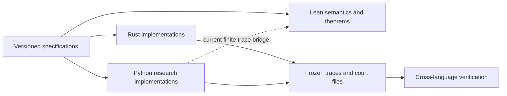

# Chambers

[](https://github.com/XyraSinclair/chambers/actions/workflows/ci.yml)

Chambers is a formal and executable model for bounded computation over private
data. It combines reader-indexed exposure accounting, append-only evidence, and
settlement rules that release value only against recorded work.

The question is deliberately narrower than “how do we make arbitrary
computation private?” Chambers asks what rights can be granted, what information
can cross a boundary, what evidence must remain afterward, and which claims a
stranger can verify without seeing the underlying private material.

The repository contains versioned specifications, a Lean formalization, two
separate Rust implementations of protocol surfaces, and Python research
implementations that exercise complete economic scenarios. Lean is the intended
semantic center. Python is useful implementation and experiment machinery; it is
not the source of mathematical authority.

## Authority and correspondence



The solid edges describe the present assurance structure. The dashed edge is a
known limitation: selected Lean golden traces are currently generated from the
Python accountant and replayed in Lean. The next formalization step is to reverse
that dependency for the accountant core: Lean should emit the canonical
decision oracle, and executable implementations should be checked against it.

A versioned specification defines the protocol surface. Lean proves properties
of the model encoded under [`chambers/lean/`](chambers/lean/). Frozen artifacts
bind implementations to concrete decisions and bytes. None of these silently
inherits the claims of the others.

## Formal kernel

The Lean project is the most compact statement of the system’s load-bearing
laws. It uses a pinned Lean toolchain and no mathlib. Current modules prove, among
other results:

- accepted exposure never exceeds its ceiling, and cumulative exposure is
  exactly the sum of accepted debits;
- lease partition preserves a global cap under arbitrary interleavings;
- audience widening is one-way and every reader outside the generating tuple is
  explained by a named widening;
- settlement conserves value, including raw adversarial event models for the
  gates formalized so far;
- selected audit findings are sound and complete over arbitrary event soups,
  with permanent findings separated from findings that retract only when their
  named missing fact arrives;
- largest-remainder attribution conserves the payment pot, while the floor-only
  rule has a checked counterexample;
- merge cannot lower the modeled leakage class or clear a permanent conviction.

The root module also checks the axiom dependencies of headline theorems. See
[`chambers/lean/README.md`](chambers/lean/README.md) for the theorem inventory
and [`docs/FORMALIZATION.md`](docs/FORMALIZATION.md) for the next proof program.

## Specifications, implementations, and evidence

**Normative specifications.**
[`docs/SPECS.md`](docs/SPECS.md) indexes the live identifiers and their defining
files. The specifications define canonical events, decision rules, audit codes,
settlement behavior, and conformance artifacts.

**Rust implementations.**
[`chambers/conformance/rust/`](chambers/conformance/rust/) implements the
egress-accountant decision surface.
[`chambers/kernel/rust_ledger/`](chambers/kernel/rust_ledger/) verifies ledger
and settlement artifacts. They were implemented separately from the
corresponding Python source, but by the same author; this is source isolation,
not independent social confirmation.

**Python research implementations.**
[`chambers/kernel/`](chambers/kernel/) and the scenario directories under
[`chambers/`](chambers/) provide the broadest executable surface: mediation,
settlement, introductions, IP trades, security bounties, peer-prediction
experiments, and an end-to-end pipeline. They are valuable for integration,
counterexamples, and rapid protocol research. Core claims should migrate toward
Lean definitions, proof-producing checkers, or language-independent
conformance artifacts rather than becoming Python-specific conventions.

**Working chamber and demos.**
[`chambers/chamber.py`](chambers/chamber.py) with its runbook
[`chambers/CHAMBER.md`](chambers/CHAMBER.md) is a single-file, stdlib-only
working chamber: one requester, one bounded question, review gates, and a
court-file audit trail, with court-file and requester-bundle verifiers
alongside. [`chambers/corpus_demo/`](chambers/corpus_demo/) demonstrates guest
confinement against a contract and sink schema;
[`chambers/compliance_kit/`](chambers/compliance_kit/) packages the normative
specs with a hash manifest and checker.

**Research lineage.**
[`LITERATURE.json`](LITERATURE.json) maps primary sources to the exact
repository surfaces that use them. Each record states the relationship, the
mechanism imported, and the boundary of what the citation does not establish.
[`docs/LITERATURE.md`](docs/LITERATURE.md) is the generated reading view.

**Claim boundaries.**
[`docs/BOOK.md`](docs/BOOK.md) gives the compact object/axiom/refusal account.
[`docs/ASSURANCE.md`](docs/ASSURANCE.md) separates types, conformance, formal
proof, adversarial evidence, and deployment evidence.

## Build the evidence

```text
cd chambers/lean
lake build

cd ../conformance/rust
cargo test --locked
cargo run --locked -- --emit out
cd ../../..
python3 -m chambers.conformance.check_conformance \
  --actual chambers/conformance/rust/out

cd chambers/kernel/rust_ledger
cargo test --locked
cd ../../..

python3 -m chambers.literature check
python3 -m pytest -q
```

The order is intentional: formal claims first, isolated protocol
implementations second, research and integration implementations third.

## Current limits

Chambers does not prove that arbitrary private computation is confidential.
The meter accounts for modeled reader-relative channels, not downstream harm.
Signatures identify keys, not unique people. The current formalization does not
cover every audit code, estimator, parser, runtime, or deployment. The
reproducible-local runtime exists; TEE-backed attestation is specified as a
higher assurance rung, not implemented here. A complete model-to-implementation
refinement proof remains open.

These are design boundaries, not footnotes. New work should either reduce one of
them or preserve it explicitly.

## Repository guide

- [`docs/README.md`](docs/README.md) — reading map.
- [`docs/primitives/`](docs/primitives/) — typed vocabulary and composition
  laws.
- [`chambers/conformance/`](chambers/conformance/) — language-independent
  accountant specification and frozen traces.
- [`chambers/lean/`](chambers/lean/) — formal model and theorem inventory.
- [`chambers/kernel/`](chambers/kernel/) — executable ledger, audit, settlement,
  identity, scope, and node surfaces.
- [`docs/frontier/`](docs/frontier/) — open research questions and mechanism
  proposals.
- [`docs/autoresearch/`](docs/autoresearch/), [`docs/ideation/`](docs/ideation/),
  [`docs/research/`](docs/research/) — the working record that produced the
  canon: stress tests, the atlas that killed 28 of 32 candidate domains, the
  ideation series, and deep-read syntheses.

## Citation and contribution

Machine-readable citation metadata is in [`CITATION.cff`](CITATION.cff).
Contribution standards are in [`CONTRIBUTING.md`](CONTRIBUTING.md); maintainer
and agent invariants are in [`AGENTS.md`](AGENTS.md).

## License

[The Harvest License](LICENSE.md). Use it, fork it, sell it. At most once a year
the steward may ask what the work has been worth to you. Money, work, releasing
your own work under the same terms, or an honest zero all satisfy the license.
Only silence breaches it.

## Findings

Conformance divergences, specification ambiguities, and corpus errors should
name the affected identifier and trace. Security reports follow
[`SECURITY.md`](SECURITY.md).
