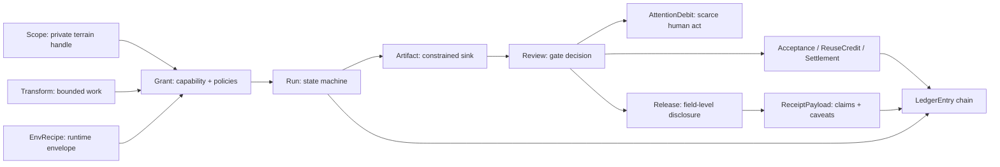

# Practice cashout playbook

This playbook turns the type atlas into product behavior. It asks: if Scry Chambers worked, what would actually cash out for an owner, requester, sponsor, worker, steward, or market participant?

The answer should not be "an agent produced a summary." The answer should be one of four scarce acts:

1. **Authority change**: approve, reject, revoke, route, delegate, or override a grant.
2. **Disclosure change**: release, redact, reject, delay, bilateral-reveal, or publicize an output.
3. **Economic change**: fund a bounty, accept work, release payment, assign reuse credit, slash, refund, or set precedent.
4. **Incident/liability change**: quarantine, appeal, investigate, notify, preserve, revoke, or close a risk.

Everything else should become structured owner-visible memory, batched receipts, evaluator work, or no-op.

## 1. The common loop

Every scenario below should compile to the same skeleton:



The product should not require a new ontology for every scenario. If dating, hiring, grantmaking, investor diligence, and bounty work require different core records, the core is wrong.

## 2. Scenario A: investor diligence without dossier leakage

### Use case

A requester asks whether a founder's private work history shows evidence of turning ambiguous, high-context ideas into shipped, reviewable software while preserving privacy boundaries.

This is close to the current Chamber demo. The requester should not get filenames, exact counts, private project names, transcripts, customer names, private path structure, or embarrassing context. The owner should see the full question, worker output, reviewer decisions, scans, and release candidate.

### Flow

| Stage | Record | Product behavior |
|---|---|---|
| Private terrain | `Scope` | Owner selects local work-history class; real paths stay owner-private. |
| Work | `Transform` | Question is restricted to aggregate evidence and capped answer length. |
| Authority | `Grant` | Read-only worker gets approved scope, output policy, no network, no raw dump. |
| Runtime | `EnvRecipe` | Local read-only sandbox or clean-path worker; logs are retained owner-private. |
| Output | `Artifact(kind="worker_output")` | Worker writes schema-bound evidence cards and a short candidate answer. |
| Review | `Review(gate="release")` | Two reviewers inspect leakage and grounding. |
| Attention | `ReviewCard(decisionNeeded="approve_release")` | Owner sees only a release decision, not every worker thought. |
| Disclosure | `Release` | Approved fields are short, aggregate, non-identifying, caveated. |
| Receipt | `ReceiptPayload` | States process facts and caveats; refuses perfect-secrecy claims. |

### Cashout

- Owner cashout: can answer a high-value diligence question without sending a folder, transcript, or open-ended Claude chat to a requester.
- Requester cashout: receives a review-gated aggregate answer and receipt, not a trust-me summary.
- Product cashout: proves the primitive spine with one local machine and append-only records.

### What to avoid

- Exact artifact counts: leaks corpus shape.
- Exact timestamps: leaks work cadence and private events.
- Private path fragments: leaks identity and project context.
- Source list disclosure: allows requester to reconstruct sensitive work graph.
- Reviewer free-form confidence without caveats: launders uncertainty.

### Minimal records to preserve

- `Grant`: who approved read-only work.
- `Run`: when and under which gate it ran.
- `Artifact`: worker output, deterministic scan, release candidate, receipt.
- `Review`: preflight and release reviewer decisions.
- `Release`: final field-level disclosure.
- `ReceiptPayload`: process claim and caveats.
- `LedgerEntry`: full reconstruction trail.

## 3. Scenario B: bounty over private notes

### Use case

A sponsor wants agents to find overlooked opportunities in an owner's private notes: potential introductions, grant ideas, research leads, product risks, or market openings. The sponsor should not receive notes. Agents should not be paid for reading; they should be paid only for accepted, low-leakage deltas.

### Flow

1. Owner defines `Scope` over note classes, not raw notebook locations.
2. Sponsor posts `Bounty` for a target class: e.g. "find cross-disciplinary grant opportunities".
3. Chamber creates `Transform` with output schema `CognitiveDelta(kind="opportunity")`.
4. Owner or policy creates `Grant` for admitted worker package and scopes.
5. Worker emits proposed deltas into `Artifact(kind="annotation")`.
6. Guardian reviews grounding, novelty, leakage, and sponsor relevance.
7. Owner accepts, rejects, edits, or quarantines each delta.
8. Accepted deltas may become `Annotation` and `Acceptance` records.
9. Payment occurs only through `CreditSettlement`, after acceptance and any release/payment gate.
10. Sponsor sees only release-approved summary or receipt, not raw support.

### Cashout

- Worker: earns on accepted structure, not token burn.
- Owner: receives useful opportunities without selling access.
- Sponsor: funds useful cognition while receiving only approved output.
- Market: starts to discover prices for low-leakage cognitive deltas.

### Key type pressure

`Bounty` must not confer access. It should point to target classes, accepted delta kinds, acceptance rules, payout rules, and budget. Access still flows through `Grant` and `Scope`.

```ts
type BountyCashout = {
  bountyId: Id<"Bounty">;
  acceptedDeltaId: Id<"CognitiveDelta">;
  releaseRequired: true;
  sponsorVisibleArtifactId?: Id<"Artifact">;
  settlementId?: Id<"CreditSettlement">;
};
```

### Abuse checks

- A sponsor posts many small bounties to infer what exists. Mitigation: bounty classes are coarse; requester-visible status is bucketed; repeated-query composition is tracked.
- Worker optimizes for spammy findings. Mitigation: `AcceptanceRule`, reviewer cost, reputation scoped to accepted non-leaky deltas, and attention budget.
- Owner accepts a finding but edits it before release. Mitigation: `Acceptance.ownerEditedBeforeReuse` and `ReuseCredit` decide whether the original worker earns downstream credit.
- Payout itself reveals the existence of a rare private fact. Mitigation: settlement visibility, delayed payout receipts, and no public leaderboard by default.

## 4. Scenario C: dating or collaboration match without denominator leakage

### Use case

Two private chambers want to know whether there is a meaningful personal or collaboration fit. The value is exactly the thing that leaks: rare compatibility, unusual preferences, constraints, or vulnerabilities.

### Flow

1. Each owner defines `Scope` for relevant private context classes.
2. A matcher transform emits `MatchCandidate` records only to owner-private sinks.
3. `DenominatorPolicy` hides exact pool size, rank, and rarity.
4. A guardian checks for asymmetric disclosure and repeated-query reconstruction.
5. Each party receives a separate `ReviewCard` describing a minimized candidate reason.
6. Only if both approve does `BilateralRelease` create a mediated intro.
7. Receipt says a bounded matching process occurred, not why the other person was rare.

### Cashout

- Owner: learns about a potential high-fit person without broadcasting raw preferences.
- Counterparty: not exposed unless they separately approve.
- Product: turns private context into selective agency rather than public profiles.

### Hard rule

No match output should reveal:

- exact rank;
- exact denominator;
- exact rare trait;
- exact private quote;
- "you are the only person" style uniqueness;
- repeated near-miss differences across queries;
- sponsor or requester-visible rejection reasons.

### Type pressure

Matchmaking needs `TargetRelation`, `DenominatorPolicy`, and `BilateralRelease`, but these should remain a module. The core still uses `Scope`, `Grant`, `Run`, `Artifact`, `Review`, `Release`, and `ReceiptPayload`.

## 5. Scenario D: private hiring or talent search

### Use case

A team wants to find people whose private work history suggests unusual fit for a role. The system should not become an intrusive monitoring platform or a private-dossier marketplace.

### Flow

- Sponsor describes target capabilities as `TargetRef`, not desired identities.
- Candidate owner controls private scopes and may choose synthetic previews or coarse classes.
- Worker emits `CognitiveDelta(kind="candidate_relation")` into owner-private sink.
- Guardian flags protected-class risk, inferred sensitive traits, and one-sided reputational harm.
- Owner chooses whether to release a minimized interest signal.
- Payment or sponsor visibility is blocked until owner release.

### Cashout

- Candidate: can be findable for the right reasons without public self-disclosure.
- Sponsor: gets warmer, safer, more honest leads than public keyword search.
- Chamber: captures a receipt proving no raw dossier disclosure.

### Review checklist

- Did the transform infer protected or sensitive traits?
- Does the output contain private employer/client/project names?
- Could the sponsor infer a rejection reason from timing or status?
- Is the candidate's non-response visible?
- Is any reputation score exportable outside the Chamber?
- Does payout reveal the candidate's fit before release?

## 6. Scenario E: grantmaking and strange-fit discovery

### Use case

A foundation wants to discover people or projects with unusual fit to a grant thesis, especially where public applications are costly or privacy-sensitive.

### Flow

1. Foundation posts a `Bounty` for a grant thesis.
2. Owners opt in with scopes or synthetic previews.
3. Agents produce `CognitiveDelta(kind="opportunity")` or `candidate_relation`.
4. Reviewers evaluate grounding and leakage.
5. Owners approve a disclosure packet or mediated intro.
6. Foundation funds accepted releases, not raw search access.

### Cashout

- Foundation: reaches people who would not broadcast fit.
- Owner: gets optional opportunity without becoming searchable by default.
- Market: pays for useful discovery under constraints.

### Important caveat

Grantmaking can leak scarcity and identity through "shortlist" mechanics. The denominator policy must treat shortlist membership, queue order, and reviewer escalation as emissions.

## 7. Scenario F: cached cognition as owner-private institution memory

### Use case

A Chamber should get smarter over time. Accepted review cards, corrections, objections, and calibrations should make later runs cheaper and better. But memory is dangerous: hidden reuse can leak; stale facts can mislead; external cache hits can reveal private existence.

### Flow

1. Worker emits `CognitiveDelta`.
2. Review accepts or rejects it.
3. Accepted delta becomes owner-private `Annotation`.
4. Later transform declares `ReuseEdge` to that annotation.
5. Reviewer can see reuse dependency and stale-source status.
6. If released, receipt can say prior accepted annotations were used without revealing raw source.

### Cashout

- Owner: builds a private research institution rather than a pile of transcripts.
- Worker: may earn reuse credit if declared and accepted.
- Reviewer: sees provenance without rereading raw context.

### Invalidation events

- Owner edited source.
- Policy changed.
- Incident opened.
- Reviewer found hallucinated grounding.
- Better annotation superseded old one.
- Consent or retention expired.

Each invalidation should be a ledgered event, not a hidden cache mutation.

## 8. Scenario G: side-channel red-team run

### Use case

Before letting an external sponsor or worker into a Chamber, run a red-team transform that attempts to infer private facts through non-answer surfaces.

### Surfaces to test

| Surface | Example leakage | Mitigation |
|---|---|---|
| Requester status | "review escalated" implies sensitive content | Coarse status only; delayed transitions |
| Timing | long run implies huge corpus or rare match | time buckets; padding for sensitive classes |
| Token count | input size or complexity | owner-private only; bucketed internally |
| Output byte count | number of findings | cap and bucket |
| Exact counts | corpus size, match rarity | forbidden unless release-approved |
| Cache hit | prior similar private fact exists | hidden or delayed; no external cache hit receipts |
| Payout | high-value fact accepted | delayed, aggregated, or owner-only |
| Leaderboard | worker did many private-domain tasks | no public leaderboard by default |
| Error message | path, table, filename, secret class | deterministic scan and redaction |
| Reviewer queue | severity from escalation order | bucketed queue classes |

### Cashout

A red-team run does not produce user-facing value directly. It produces a safer policy record, risk vector, and receipt caveat. That is still a product asset.

## 9. Scenario H: partner silo environment setup

### Use case

A partner organization wants to run third-party no-network agents inside its own private data environment. The product should provide recipes, grants, review files, and receipts, not tell the partner to trust a generic agent.

### Flow

- Partner creates `Chamber` and coarse `Scope` records over systems: docs, CRM, tickets, notebooks, data warehouse, code repos.
- Admin approves `AgentPackage` and `EnvRecipe`.
- `Grant` binds the package to scopes, tools, output policy, and review plan.
- Worker writes only to sink artifacts.
- `EnvironmentReceiptPayload` records observed mounts, tool use, network behavior, and caveats.
- `Review` and `Release` control any external disclosure.

### Cashout

- Partner: can recruit external cognition without open-ended data export.
- Agent author: can ship useful transforms into private environments.
- Chamber: becomes a procurement and audit boundary, not an agent chat app.

### What the environment recipe must say

- Mounts and classes, not secret raw paths in public receipt.
- Network mode and blocked attempts.
- Tool grants and model access.
- Runtime budget.
- Logging policy.
- Secret policy.
- What the recipe does not prove.

## 10. Common product screens

### Owner run console

Shows:

- question/request summary;
- grant and scope classes;
- current gate;
- reviewer decisions;
- risk vectors;
- release candidate;
- receipt preview;
- attention cost;
- incident state;
- ledger tail.

Does not default to:

- raw worker transcript;
- raw file paths;
- token-by-token logs;
- exact private corpus counts;
- hidden scratch artifacts.

### Requester page

Shows:

- coarse status;
- released answer if approved;
- receipt if approved;
- optional fixed drill-down if separately reviewed.

Does not show:

- owner token;
- raw output;
- reviewer disagreements;
- exact rejection reason;
- execution timing that implies private complexity;
- whether a rare sensitive fact existed.

### Worker author page

Shows:

- package manifest hash;
- allowed output schema;
- rejection classes;
- aggregate acceptance quality;
- owner-approved public examples only.

Does not show:

- raw private examples;
- exact private run count;
- cache hit details;
- hidden reviewer notes;
- owner identity unless released.

### Sponsor/bounty page

Shows:

- bounty target class;
- budget class;
- accepted release-approved deltas;
- aggregated settlement status;
- caveats.

Does not show:

- unaccepted submissions;
- owner-private rejection reasons;
- exact denominator;
- private source handles;
- per-run timing or queue position.

## 11. Cashout ladders

### Attention ladder

| Level | Event | Product action |
|---|---|---|
| 0 | Routine finding | Store owner-private; no interrupt. |
| 1 | Potentially useful finding | Batch into review queue. |
| 2 | High-value but low-risk finding | Review card in next owner session. |
| 3 | Authority/disclosure/economic decision | Interrupt in owner console. |
| 4 | Incident/liability risk | Immediate incident workflow. |

### Market ladder

| Level | Market behavior | Required guardrail |
|---|---|---|
| 0 | Owner-private accepted annotation | No external visibility. |
| 1 | Reuse in later owner run | Declared `ReuseEdge`. |
| 2 | Internal credit to worker | Owner-visible `Acceptance`. |
| 3 | Sponsor-visible minimized output | `Release` + caveated receipt. |
| 4 | External payout | Payment gate + egress budget + settlement ledger. |
| 5 | Public reputation | Separate release-screened aggregate; default no. |

### Disclosure ladder

| Level | Disclosure | Examples |
|---|---|---|
| 0 | None | Rejected run, quarantined annotation. |
| 1 | Owner-only | Full worker output, reviewer notes. |
| 2 | Reviewer-private | Source handles, expansion artifact. |
| 3 | Requester-visible coarse | Status, capped answer, receipt. |
| 4 | Bilateral release | Mediated match intro. |
| 5 | Public | Owner-approved public example or aggregate. |

## 12. Product taste rules

- The UI should not ask "do you approve this agent?" It should ask "do you authorize this bounded transform over these private classes under this recipe and sink?"
- The requester should never watch the owner think.
- The sponsor should never buy access by decorating it as a bounty.
- The worker should never earn by consuming tokens alone.
- The receipt should never claim privacy magic.
- The owner should feel fewer asks over time, not more.
- A good Chamber run leaves a small court file: authority, scope, recipe, artifacts, reviews, release, receipt, caveats, ledger.
- A good market pays for deltas that make future work cheaper, safer, or more useful.

## 13. First demo sequence to implement

A practical demo should prove this sequence before adding a marketplace:

1. Owner selects a private context class.
2. Requester submits a bounded question.
3. System generates `Transform`, `Grant`, and `EnvRecipe` sidecars.
4. Worker runs and emits `Artifact(kind="worker_output")` and `Artifact(kind="annotation")`.
5. Guardian turns worker output into `ReviewCard` objects.
6. Owner approves/rejects execution and release through two explicit cards.
7. Released answer gets `ReceiptPayload` with non-claims.
8. Accepted annotation becomes owner-private `CognitiveDelta`.
9. A second run declares `ReuseEdge` to the accepted annotation.
10. Receipt says prior owner-accepted annotations were used, without exposing raw source.

This sequence proves the private institution loop: run, review, accept, remember, reuse, release.
